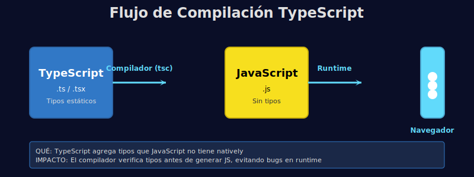

# 🧭 Introducción a TypeScript

## 🎯 Objetivos

- Entender qué es TypeScript y por qué se usa en React
- Conocer el flujo de compilación TS → JS
- Configurar un entorno básico con tsconfig

---

## 📋 Contenido

### 1. ¿Qué es TypeScript?

TypeScript es un superset de JavaScript que agrega **tipos estáticos**. Esto permite:

- Detectar errores antes de ejecutar
- Mejor autocompletado en el editor
- Código más mantenible y escalable

### 2. ¿Por qué usar TypeScript en React?

- Evita errores comunes en props y estado
- Mejora la colaboración en equipos grandes
- Facilita refactors con seguridad

### 3. Flujo de trabajo

```text
TypeScript (.ts/.tsx) → Compilador (tsc) → JavaScript (.js)
```



### 4. Configuración mínima (tsconfig)

```json
{
  "compilerOptions": {
    // QUÉ: especificar la versión de JavaScript de destino
    // PARA: que el compilador genere código compatible
    // IMPACTO: define qué características ES podemos usar
    "target": "ES2023",

    // QUÉ: tipo de módulos que genera el compilador
    // PARA: permitir import/export modernos
    // IMPACTO: genera módulos que Vite entiende
    "module": "ESNext",

    // QUÉ: activar verificación de tipos estricta
    // PARA: detectar máximo de errores en tiempo de compilación
    // IMPACTO: obliga a ser más explícito, pero evita bugs
    "strict": true,

    // QUÉ: cómo compilar JSX/TSX
    // PARA: que React 18+ entienda nuestros componentes
    // IMPACTO: permite escribir componentes con sintaxis JSX
    "jsx": "react-jsx"
  }
}
```

> 💡 En este bootcamp, TypeScript siempre está en modo **strict**.

---

## 🧪 Ejemplo rápido

```typescript
// QUÉ: declarar una constante con tipo explícito
// PARA: que TypeScript verifique que siempre sea string
// IMPACTO: el editor alerta si asignas valor incorrecto
const bootcampName: string = 'React + TypeScript';

// QUÉ: intentar asignar un número a una variable string
// PARA: demostrar la verificación de tipos
// IMPACTO: TypeScript marca error antes de ejecutar el código
// bootcampName = 123; // ❌ Error de tipo (descomenta para verlo)
```

---

## 📚 Recursos Adicionales

- https://www.typescriptlang.org/docs/
- https://react.dev/learn

---

## ✅ Checklist de Verificación

- [ ] Entiendo qué es TypeScript
- [ ] Sé por qué se usa en React
- [ ] Conozco el flujo TS → JS
- [ ] He visto la configuración básica del tsconfig
