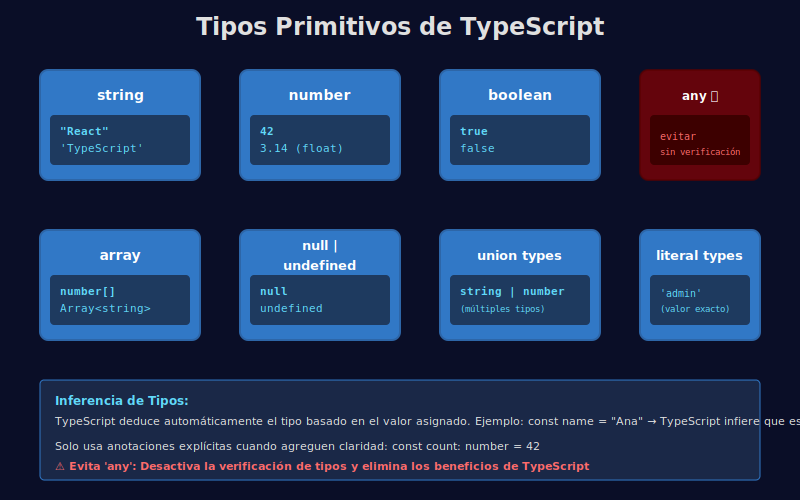

# 🧱 Tipos Primitivos y Anotaciones

## 🎯 Objetivos

- Conocer los tipos primitivos de TypeScript
- Usar anotaciones básicas en variables
- Entender inferencia de tipos

---

## 📋 Contenido

### 1. Tipos primitivos

```typescript
// QUÉ: variable string (texto)
// PARA: almacenar el nombre del bootcamp
// IMPACTO: TypeScript asegura que siempre sea texto
const course: string = 'React + TypeScript';

// QUÉ: variable number (número)
// PARA: almacenar duración en semanas
// IMPACTO: solo se pueden hacer operaciones numéricas
const durationWeeks: number = 20;

// QUÉ: variable boolean (verdadero/falso)
// PARA: indicar si el bootcamp está activo
// IMPACTO: solo puede ser true o false
const isActive: boolean = true;

// QUÉ: array tipado (lista de strings)
// PARA: almacenar múltiples etiquetas del bootcamp
// IMPACTO: cada elemento del array debe ser string
const tags: string[] = ['react', 'typescript', 'docker'];
```



### 2. Null y undefined

```typescript
// QUÉ: variable que puede ser string O null
// PARA: representar un valor opcional que puede no existir
// IMPACTO: TypeScript obliga a validar antes de usar como string
let selectedTopic: string | null = null;

// QUÉ: variable que explícitamente es undefined
// PARA: indicar un valor no inicializado
// IMPACTO: diferencia entre "no tiene valor" y "tiene null"
let currentUser: undefined;
```

### 3. Inferencia de tipos

TypeScript infiere el tipo automáticamente cuando es obvio.

```typescript
// QUÉ: variable sin anotación explícita
// PARA: dejar que TypeScript deduzca el tipo
// IMPACTO: TypeScript infiere automáticamente que es string
const level = 'intermediate'; // ✅ tipo: string

// QUÉ: variable sin anotación explícita
// PARA: dejar que TypeScript deduzca el tipo
// IMPACTO: TypeScript infiere automáticamente que es number
const totalHours = 160; // ✅ tipo: number
```

> 💡 Solo usa anotaciones explícitas cuando agregan claridad.

---

## 🧪 Ejemplo con arrays tipados

```typescript
// QUÉ: array que contiene solo números
// PARA: almacenar calificaciones del bootcamp
// IMPACTO: cada elemento debe ser number
const scores: number[] = [90, 85, 100];

// QUÉ: intentar agregar un string al array de números
// PARA: demostrar que TypeScript previene errores
// IMPACTO: TypeScript marca error antes de ejecutar
// scores.push('A'); // ❌ Error de tipo: 'A' no es number
```

---

## 📚 Recursos Adicionales

- https://www.typescriptlang.org/docs/handbook/2/everyday-types.html

---

## ✅ Checklist de Verificación

- [ ] Identifico tipos primitivos en TS
- [ ] Sé cuándo usar anotaciones
- [ ] Entiendo la inferencia de tipos
- [ ] Puedo tipar arrays correctamente
