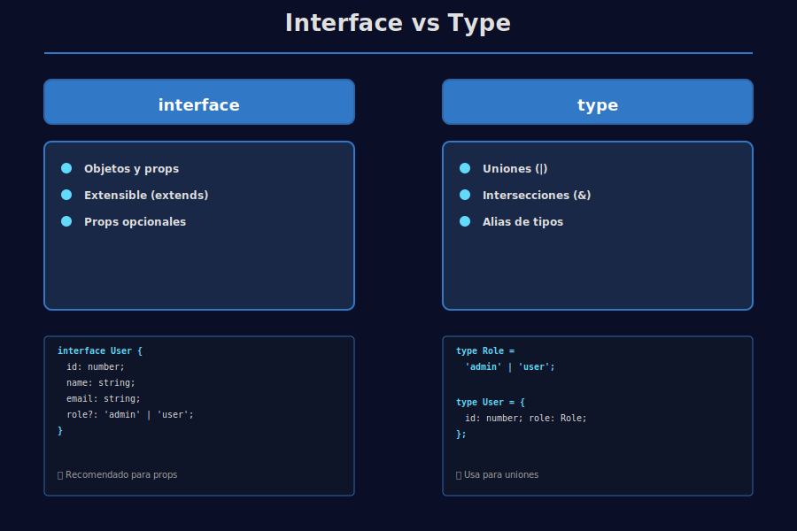
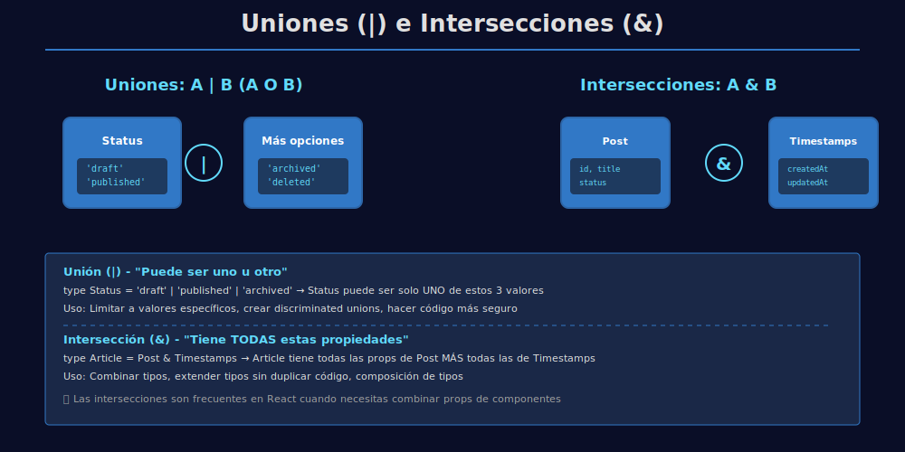

# 🧩 Interfaces vs Types

## 🎯 Objetivos

- Diferenciar `interface` y `type`
- Modelar objetos con tipos explícitos
- Aplicar uniones e intersecciones

---

## 📋 Contenido

### 1. Interfaces

```typescript
// QUÉ: definir la forma de un objeto User
// PARA: especificar qué propiedades tiene un usuario
// IMPACTO: TypeScript valida que los usuarios cumplan esta estructura
interface User {
  // QUÉ: identificador único del usuario
  // IMPACTO: obligatorio, debe ser número
  id: number;

  // QUÉ: nombre del usuario
  // IMPACTO: obligatorio, debe ser texto
  name: string;

  // QUÉ: correo electrónico del usuario
  // IMPACTO: obligatorio, debe ser texto
  email: string;
}
```

### 2. Types

```typescript
// QUÉ: definir un tipo que solo acepta 3 valores
// PARA: representar los roles posibles en el bootcamp
// IMPACTO: TypeScript valida que role sea uno de estos 3 valores
type Role = 'admin' | 'student' | 'mentor';

// QUÉ: definir la forma de un objeto User con role
// PARA: extender la información del usuario
// IMPACTO: type permite uniones (|) e intersecciones (&)
type User = {
  id: number;
  name: string;
  email: string;
  // QUÉ: asignar el tipo Role a esta propiedad
  // IMPACTO: solo acepta 'admin', 'student' o 'mentor'
  role: Role;
};
```

### 3. ¿Cuál usar?

- ✅ `interface`: recomendado para objetos y props
- ✅ `type`: útil para uniones, intersecciones y alias



### 4. Uniones e intersecciones

```typescript
// QUÉ: tipo que representa 3 posibles estados
// PARA: definir en qué estado está un artículo
// IMPACTO: TypeScript valida que status sea uno de estos 3 valores
type Status = 'draft' | 'published' | 'archived';

// QUÉ: tipo que define propiedades de fecha
// PARA: reutilizar información de creación/actualización
// IMPACTO: evita duplicar código en múltiples tipos
type WithTimestamps = {
  createdAt: string;
  updatedAt: string;
};

// QUÉ: combinar un tipo base con WithTimestamps
// PARA: crear un Post que tenga todas estas propiedades
// IMPACTO: & (intersección) une dos tipos en uno
type Post = {
  id: number;
  title: string;
  status: Status;
} & WithTimestamps; // Post ahora tiene: id, title, status, createdAt, updatedAt
```



---

## 🧪 Ejemplo práctico

```typescript
// QUÉ: interface que define las propiedades de un botón
// PARA: tipar los props del componente React
// IMPACTO: TypeScript valida que quien use Button pase estos props
interface ButtonProps {
  // QUÉ: texto visible del botón
  // IMPACTO: obligatorio (sin ?)
  text: string;

  // QUÉ: estilo del botón (puede ser omitido)
  // IMPACTO: opcional gracias a ? - si no se pasa, TypeScript no reclama
  variant?: 'primary' | 'secondary';
}

// QUÉ: componente que recibe props tipadas
// PARA: renderizar un botón con estilo dinámico
// IMPACTO: si pasas props incorrectos, TypeScript alerta
const Button = ({ text, variant = 'primary' }: ButtonProps) => {
  // QUÉ: usar el valor de variant (o 'primary' si no viene)
  // PARA: aplicar la clase CSS correcta
  // IMPACTO: template literal interpola el valor de variant
  return `<button class="btn-${variant}">${text}</button>`;
};
```

---

## 📚 Recursos Adicionales

- https://www.typescriptlang.org/docs/handbook/2/everyday-types.html#interfaces

---

## ✅ Checklist de Verificación

- [ ] Sé cuándo usar `interface`
- [ ] Sé cuándo usar `type`
- [ ] Entiendo uniones e intersecciones
- [ ] Puedo tipar props con interfaz
