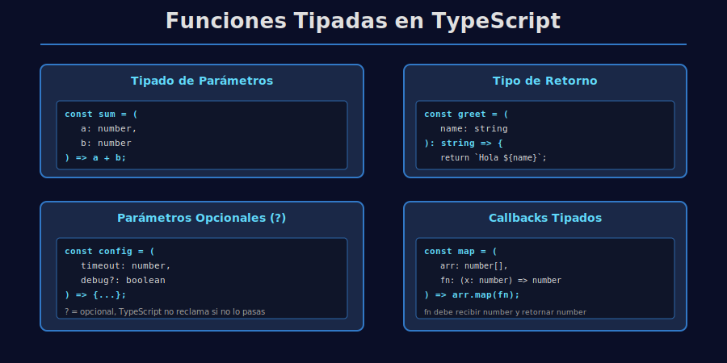

# 🧪 Funciones Tipadas

## 🎯 Objetivos

- Tipar parámetros y retornos
- Usar parámetros opcionales
- Aplicar tipos en callbacks

---

## 📋 Contenido

### 1. Funciones con tipos

```typescript
// QUÉ: función que recibe precio y cantidad
// PARA: calcular el total (precio × cantidad)
// IMPACTO: TypeScript valida que los parámetros sean números
const calculateTotal = (price: number, quantity: number): number => {
  // QUÉ: especificar qué tipo retorna la función
  // PARA: que TypeScript valide el retorno
  // IMPACTO: si retornas string en vez de number, TypeScript lo detecta
  return price * quantity;
};
```



### 2. Parámetros opcionales

```typescript
// QUÉ: función de saludo con apellido opcional
// PARA: permitir saludar con solo nombre o con nombre + apellido
// IMPACTO: lastName puede ser omitido sin error de TypeScript
const greet = (name: string, lastName?: string): string => {
  // QUÉ: si lastName existe, incluirlo en el saludo
  // PARA: adaptar el mensaje según los datos disponibles
  // IMPACTO: evita errores de undefined cuando lastName no se pasa
  return lastName ? `Hola ${name} ${lastName}` : `Hola ${name}`;
};
```

### 3. Tipos en callbacks

```typescript
// QUÉ: función que transforma cada valor con una función personalizada
// PARA: permitir aplicar cualquier transformación a un array
// IMPACTO: la función callback debe recibir number y retornar number
const mapValues = (
  // QUÉ: array de números a transformar
  values: number[],
  // QUÉ: función que recibe un número y retorna un número
  // PARA: permitir transformaciones personalizadas
  // IMPACTO: TypeScript valida que fn cumpla este contrato
  fn: (value: number) => number,
): number[] => {
  // QUÉ: aplicar la función a cada elemento
  // IMPACTO: el resultado es también un array de números
  return values.map(fn);
};
```

---

## 🧪 Ejemplo práctico

```typescript
// QUÉ: interface que define la forma de un logger
// PARA: especificar qué métodos debe tener un logger
// IMPACTO: cualquier logger debe cumplir esta estructura
interface Logger {
  // QUÉ: método que recibe un mensaje y no retorna nada (void)
  // IMPACTO: TypeScript valida que solo imprima, no retorne datos
  log: (message: string) => void;
}

// QUÉ: crear un objeto que cumple con Logger
// PARA: implementar un logger concreto
// IMPACTO: TypeScript verifica que log cumpla la firma requerida
const logger: Logger = {
  // QUÉ: implementar el método log
  // PARA: mostrar mensajes con prefijo [LOG]
  // IMPACTO: message viene tipado como string
  log: (message) => {
    console.log(`[LOG] ${message}`);
  },
};
```

---

## 📚 Recursos Adicionales

- https://www.typescriptlang.org/docs/handbook/2/functions.html

---

## ✅ Checklist de Verificación

- [ ] Tipé parámetros y retornos correctamente
- [ ] Entiendo parámetros opcionales
- [ ] Sé tipar callbacks
