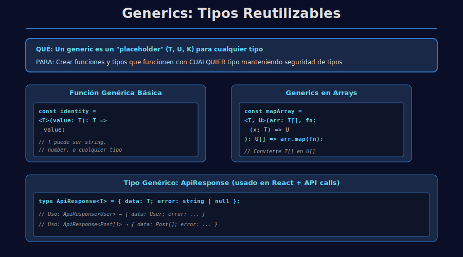
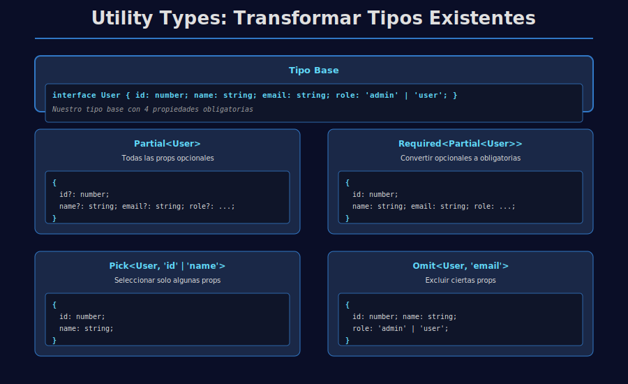

# 🧬 Generics y Utility Types

## 🎯 Objetivos

- Entender qué son los generics
- Usar generics en funciones y tipos
- Aplicar utility types comunes

---

## 📋 Contenido

### 1. Generics básicos

```typescript
// QUÉ: función genérica que devuelve lo mismo que recibe
// PARA: crear funciones que funcionen con cualquier tipo
// IMPACTO: <T> es un "placeholder" para cualquier tipo
const identity = <T>(value: T): T => {
  // QUÉ: retornar el mismo valor que recibimos
  // PARA: demostrar que T se preserva
  // IMPACTO: si pasas string, retorna string; si pasas number, retorna number
  return value;
};

// QUÉ: llamar identity especificando que T es string
// PARA: indicar que queremos trabajar con strings
// IMPACTO: TypeScript deduce que result es de tipo string
const result = identity<string>('TypeScript');
```



### 2. Generics en arrays

```typescript
// QUÉ: función que transforma un array de tipo T a tipo U
// PARA: permitir transformaciones de tipos diferentes
// IMPACTO: <T, U> son dos tipos genéricos independientes
const mapArray = <T, U>(
  // QUÉ: array de elementos de tipo T
  items: T[],
  // QUÉ: función que convierte T a U
  // PARA: transformar cada elemento a un tipo diferente
  fn: (item: T) => U,
  // QUÉ: retorna array de elementos de tipo U
  // IMPACTO: si T=number y U=string, transforma numbers a strings
): U[] => {
  // QUÉ: aplicar fn a cada item
  // IMPACTO: cada T se convierte en U
  return items.map(fn);
};
```

### 3. Utility Types

```typescript
interface User {
  id: number;
  name: string;
  email: string;
}

// QUÉ: crear un tipo donde todos los campos son opcionales
// PARA: permitir actualizaciones parciales de usuarios
// IMPACTO: PartialUser puede tener cualquier combinación de propiedades
type PartialUser = Partial<User>; // ✅ { id?, name?, email? }

// QUÉ: seleccionar solo algunos campos de User
// PARA: crear un tipo simplificado para vistas en lista
// IMPACTO: UserPreview solo tiene id y name
type UserPreview = Pick<User, 'id' | 'name'>; // ✅ { id: number; name: string; }

// QUÉ: crear un tipo excluyendo ciertos campos
// PARA: devolver usuario sin exponer el email en algunos casos
// IMPACTO: UserWithoutEmail tiene id y name, pero NO email
type UserWithoutEmail = Omit<User, 'email'>; // ✅ { id: number; name: string; }
```



---

## 🧪 Ejemplo práctico

```typescript
// QUÉ: tipo genérico que representa una respuesta de API
// PARA: reutilizar la estructura con diferentes tipos de datos
// IMPACTO: <T> permite que data sea cualquier tipo (User, Post, etc.)
type ApiResponse<T> = {
  // QUÉ: los datos devueltos (tipo genérico T)
  // PARA: guardar la respuesta exitosa
  data: T;

  // QUÉ: mensaje de error o null si no hay error
  // PARA: reportar si algo salió mal
  // IMPACTO: siempre se verifica error antes de confiar en data
  error: string | null;
};

// QUÉ: crear una respuesta donde T = User
// PARA: devolver información de usuario desde una API
// IMPACTO: TypeScript sabe que response.data es de tipo User
const response: ApiResponse<User> = {
  data: { id: 1, name: 'Ana', email: 'ana@bootcamp.dev' },
  error: null, // ✅ respuesta exitosa, sin error
};
```

---

## 📚 Recursos Adicionales

- https://www.typescriptlang.org/docs/handbook/2/generics.html
- https://www.typescriptlang.org/docs/handbook/utility-types.html

---

## ✅ Checklist de Verificación

- [ ] Entiendo qué es un generic
- [ ] Puedo escribir funciones genéricas
- [ ] Sé usar `Partial`, `Pick` y `Omit`
